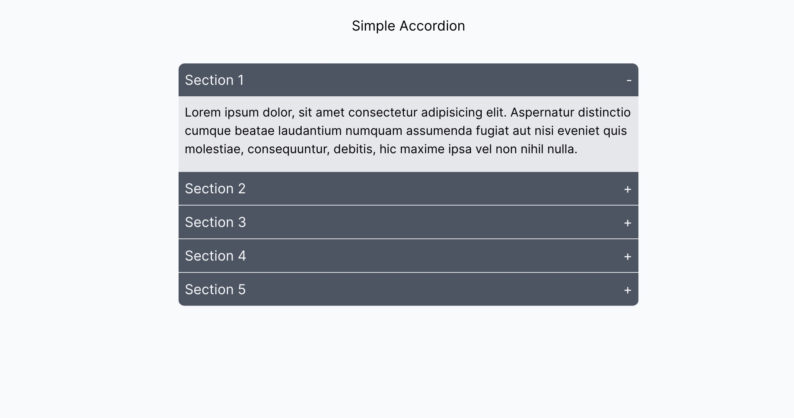

### Custom React Accordion

This is an accordion built from scratch in React. You can use it to display a list of FAQs, show menus and submenus, etc. I have used `Vite` instead of `create-react-app` to bootstrap this project so the relevant scripts are:

```sh
yarn dev / vite                    # for development server
yarn build / vite build            # for optimized production build   
yarn preview / vite preview        # see the production build  
```

The accordion is mobile responsive and you can check it out at [mathewbushuru.github.io/custom-react-accordion](https://mathewbushuru.github.io/custom-react-accordion)

